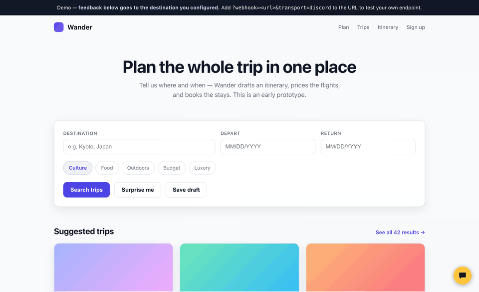

# Tyrekick

**Kick the tyres before you ship it.** Get people you trust to review your
AI-built prototype — and let your coding agent act on what they say.

[](https://www.npmjs.com/package/tyrekick)
[](README.md#how-it-works)
[](LICENSE)
[](mcp/)

Reviewers pin comments directly on the live page — no account, no training.
Your coding agent pulls them back over MCP with the exact element, its visible
text, the section heading, and any page errors attached, fixes what was
flagged, and marks it resolved. The reviewer's pin turns green with a note.
You never retype feedback into a prompt again.



**▶ [Try the live demo](https://wander-demo.pages.dev/demo/)** &nbsp;·&nbsp; [Quickstart](docs/QUICKSTART.md) &nbsp;·&nbsp; [Docs](docs/) &nbsp;·&nbsp; ["The Outer Loop" — why this exists](docs/essays/the-outer-loop.md)

*Real footage: that comment was pinned on the live demo, fixed by an agent, and the pin turned green — no retyping, no tracker, no accounts.*

## How it works

```
 reviewer's browser              destination YOU own              your coding agent
┌──────────────────┐   POST    ┌────────────────────┐    MCP    ┌─────────────────┐
│ pin a comment on │ ────────► │ Discord webhook or │ ◄───────► │ "fix the open   │
│ the live page    │           │ your CF Worker     │           │  feedback"      │
└──────────────────┘           └────────────────────┘           └─────────────────┘
```

The widget is a single ~14 KB (gzipped) script with zero dependencies, rendered in Shadow DOM so it can't fight your page. There is no Tyrekick backend, no accounts, and nothing phones home — feedback POSTs straight from the reviewer's browser to a destination **you** own. It exists for the moment an agent-built prototype needs more than one pair of eyes: instead of pasting screenshots into group chats and losing the replies, every comment arrives structured, versioned, and pinned to the exact spot.

Pins stay on the page after you leave a comment (dimmed until you interact) — hover one to see its text, click it to open the thread right there, with reply, retry, and discard actions at the pin. Reviewers also get a comment drawer (a right-hand overview listing every pin with its text — click one to jump back to that spot, or hide pins entirely), draft recovery, and full keyboard/touch support (Cmd/Ctrl+Enter sends). With `persist: true` (the default), localStorage is only used to recover unsent work across reloads — comments that couldn't be delivered come back after a reload with Retry and Discard buttons, re-pinned to the element they were about even if the window size changed.

> **Agents:** installing Tyrekick into a project? Use the [`make-reviewable` skill](skills/make-reviewable/SKILL.md) — one sentence and it hosts the page if needed, picks a destination, deploys the worker, installs the widget, wires MCP, and drafts the ask to send reviewers — or follow [`AGENTS.md`](AGENTS.md) step by step.

**Full documentation** lives in [`docs/`](docs/): [quickstart](docs/QUICKSTART.md) · [getting started](docs/getting-started.md) · [configuration](docs/configuration.md) · [the reviewer experience](docs/reviewing.md) · [destinations](docs/destinations.md) · [the agent loop](docs/agent-loop.md) · [payload reference](docs/payload.md) · [troubleshooting & FAQ](docs/troubleshooting.md)

**Sharing a prototype publicly?** Start with [taking a prototype public](docs/going-public.md), then the per-capability guides: [rate limiting](docs/rate-limiting.md) · [shared review](docs/shared-review.md) · [AI auto-reply](docs/ai-auto-reply.md).

## 60-second quickstart (Discord)

The fastest path is a Discord channel you control — the taster that proves
feedback flows somewhere you own. The full product (persistence, statuses,
your agent closing the loop over MCP) lives on the
[worker destination](#the-agent-loop-mcp) below.

**One command** (from your project folder):

```bash
npx tyrekick init
```

It asks for your webhook URL, injects the script tag, and sends a test comment.
Or by hand:

1. In Discord, open **Server Settings → Integrations → Webhooks → New Webhook**, pick a channel, and **Copy Webhook URL**.
2. Paste that URL into the snippet below and drop it before `</body>` on your prototype:

```html
<script
  src="https://cdn.jsdelivr.net/npm/tyrekick@latest/dist/tyrekick.js"
  data-webhook="https://discord.com/api/webhooks/XXXX/YYYY"
  data-app-version="v0.1"
  data-transport="discord"
  data-project-name="My Prototype"
  data-accent="#4f46e5"
  data-position="bottom-right"
  data-branding="true"
></script>
```

The IIFE build auto-initialises from its own `<script>` tag's `data-*` attributes on `DOMContentLoaded`. Reviewers get a "Give feedback" button in the corner; each comment lands in your Discord channel as a readable message.

> Only `data-webhook` and `data-app-version` are required. Everything else is optional and falls back to the defaults in the [configuration table](#configuration).

## Self-hosting / owned storage

Discord is the frictionless default, but if you want the data in storage you own, use a JSON transport (`transport: "json"`, the default) pointed at an endpoint that persists the payload.

- **Cloudflare template (TypeScript):** see [`destinations/cloudflare`](destinations/cloudflare) for a deployable Worker that receives the [v2 payload](#payload-schema-v2), validates it, and writes it to storage you control. It's a good place to add spam validation since the code is yours.
- **Same-origin Pages Function:** if your prototype is hosted on Cloudflare Pages, drop a Pages Function at the same origin (e.g. `/api/feedback`) and set `webhook` to that relative/same-origin URL. Same-origin means no CORS setup at all.

Any CORS-enabled endpoint or form backend works too — with `transport: "json"`, success is HTTP 2xx and, if a body is returned, it is not `{"ok":false}`.

## The agent loop (MCP)

The reason Tyrekick exists. With the Cloudflare Worker destination, feedback isn't just collected — your coding agent can **pull it, act on it, and resolve it**:

1. Deploy the worker and set a token (see [`destinations/cloudflare`](destinations/cloudflare)):
   ```bash
   wrangler deploy && wrangler secret put TYREKICK_TOKEN
   ```
2. Give your agent the pipeline (once — it works for every future session):
   ```bash
   claude mcp add tyrekick \
     --env TYREKICK_URL=https://tyrekick-feedback.YOUR.workers.dev \
     --env TYREKICK_TOKEN=your-token \
     -- npx tyrekick-mcp
   ```
3. Close the loop with one sentence:
   > *"List the open feedback and fix what people flagged, then resolve it."*

The agent gets five tools — `list_feedback`, `get_feedback`, `triage_feedback`, `resolve_feedback`, `feedback_stats` — and each item carries the element's visible text (greppable in your source), the nearest heading, the route, the viewport, and any uncaught page errors. A comment like *"this button does nothing"* arrives as:

```
element: <button> "Search trips"
under: "Plan your escape" · landmark: main > section#planner
page_errors: 1
> This button does nothing when I click it
```

That's a better bug report than most humans write. Full details in [`mcp/README.md`](mcp/README.md).

## Shared review (reviewers see each other)

By default a review is several private conversations: each reviewer sees their
own pins, and the comments meet at your destination. Set a **review key** and
the page itself becomes the shared surface — everyone sees everyone's pins,
read-only, with attribution. Reviewers stop reporting the same thing four times.

```bash
npx wrangler secret put TYREKICK_REVIEW_KEY   # on your worker; any long random string
```

```html
<script
  src="https://cdn.jsdelivr.net/npm/tyrekick@latest/dist/tyrekick.js"
  data-webhook="https://your-worker.workers.dev/feedback"
  data-app-version="v0.1"
  data-project-name="my-prototype"
  data-review-key="the-same-long-random-string"
></script>
```

**Read this before switching it on.** The key ships inside your page, so it is
public to anyone holding the review link: *anyone who can open the prototype can
read every comment on it, including reviewer names.* That is the right trade for
a private link you sent to five people you trust, and the wrong one for a public
URL. There is no per-reviewer identity to scope it more finely — reviewers never
log in, which is the point. Rotate the secret to revoke access.

What it does and doesn't do:

- **Read-only.** You can see and reply to another reviewer's comment; replies
  travel to your destination like any other comment, not peer-to-peer. There is
  no live presence and no on-page threading between reviewers.
- **Declining hides.** A comment you decline (via MCP or the API) disappears
  from *everyone's* page — that is how you clear spam and noise. Its author
  still sees the outcome on their own pin.
- **Project-scoped.** One worker can serve several prototypes; a review key
  only ever reads the `projectName` it was asked for. Set an explicit, stable
  `projectName` — the `document.title` fallback will fork your feedback stream
  the first time you edit the title.
- **Worker only.** Discord is write-only by design and has no shared view.
- **What other reviewers never see:** your user agent, screen or device
  fingerprint, the prototype's page errors, the full URL (share links can carry
  query-string secrets), or your session id.

## AI auto-reply (optional)

Set an Anthropic API key on your worker and each ingested comment gets one
short, friendly acknowledgement — labelled 🤖, shown only in the reviewer's
own thread — while the pin stays open (it acknowledges; it never claims to
fix anything, and never resolves the pin). The model has no tools, so
nothing inside a comment can make it take an action. Off by default.

```bash
npx wrangler secret put ANTHROPIC_API_KEY
```

## Programmatic / ESM usage

Install from your registry and initialise explicitly (the ESM build does **not** auto-init):

```bash
npm install tyrekick
```

```ts
import { init, destroy } from "tyrekick";

init({
  webhook: "https://discord.com/api/webhooks/XXXX/YYYY",
  appVersion: "v0.1",
  projectName: "My Prototype",
  transport: "discord",
});

// later, to tear down all DOM, listeners, and in-memory state:
destroy();
```

The global (IIFE) equivalent is `window.Tyrekick.init(config)` / `window.Tyrekick.destroy()`. Calling `init()` twice without `destroy()` is a no-op and warns; a missing `webhook` or `appVersion` throws.

### Frameworks / async loading (Next.js, React, bundlers)

The IIFE build auto-inits by reading its own `<script>` tag via `document.currentScript`. That value is `null` whenever the tag is injected **asynchronously** (Next.js `next/script`, a React-rendered `<script>`, or any dynamic loader), so a plain CDN tag can silently fail to start. Two supported paths:

1. **Set a global** (works with any loader). Define it before the widget script runs:

   ```html
   <script>window.tyrekickConfig = { webhook: "…", appVersion: "1.0" }</script>
   ```

   The IIFE build reads `window.tyrekickConfig` first, then its own `data-*`, then falls back to any `<script data-webhook>` already in the DOM.

2. **Call `init()` from a client component** (recommended for Next.js App Router / React):

   ```tsx
   "use client";
   import { useEffect } from "react";

   export function TyrekickWidget() {
     useEffect(() => {
       let cleanup: (() => void) | undefined;
       import("tyrekick").then(({ init, destroy }) => {
         init({ webhook: "…", projectName: "…", appVersion: "…" });
         cleanup = destroy;
       });
       return () => cleanup?.();
     }, []);
     return null;
   }
   ```

## Configuration

Every field of `TyrekickConfig` (see [`src/types.ts`](src/types.ts)):

| Field | Type | Required | Default | Description |
| --- | --- | --- | --- | --- |
| `webhook` | `string` | **yes** | — | Destination URL that receives the POST. |
| `appVersion` | `string` | **yes** | — | Version string of the prototype under review. |
| `projectName` | `string` | no | `document.title` | Human label for the project. |
| `position` | `"bottom-right" \| "bottom-left"` | no | `"bottom-right"` | Trigger button corner. |
| `accent` | `string` | no | `"#FFC53D"` | Accent for the trigger, pins, and Send button. Text on the accent auto-contrasts (dark ink on light accents, white on dark). |
| `theme` | `"auto" \| "light" \| "dark"` | no | `"auto"` | Widget colour scheme. `"auto"` follows the visitor's `prefers-color-scheme` at init and updates live when it changes. Use `data-theme` on the script tag for the auto-init build. |
| `branding` | `boolean` | no | `true` | Show the "Built by Frontier Operations" footer. |
| `fields` | `{ name?: boolean }` | no | `{ name: true }` | Toggle the optional reviewer-name input. |
| `transport` | `"json" \| "discord"` | no | `"json"` | How the payload is delivered (raw JSON vs. Discord message). |
| `persist` | `boolean` | no | `true` | Use `localStorage` only for unsent recovery: draft text and failed comments that still need retry after a reload. Submitted comments are not kept in localStorage. No storage keys are read/written when `false`. |
| `reviewKey` | `string` | no | — | **Shared review** (opt-in): every reviewer sees every other reviewer's pins, read-only. Must match `TYREKICK_REVIEW_KEY` on your Worker. The key ships in your page, so anyone with the review link can read every comment — right for a private link, wrong for a public URL. See [shared review](#shared-review-reviewers-see-each-other). |
| `captureErrors` | `boolean` | no | `true` | Record the page's uncaught errors / unhandled rejections (via `window` `"error"` and `"unhandledrejection"` listeners — the console is never patched) and attach the last ≤5 to each payload as `page_errors`. Set `data-capture-errors="false"` on the script tag for the auto-init build. Input **values** are never captured anywhere, regardless of this flag. |

## Payload schema (v2)

With `transport: "json"`, the raw body POSTed to your `webhook` is exactly this shape (`FeedbackPayload`):

```json
{
  "schema": 2,
  "id": "b1c2...",
  "created_at": "2026-07-02T10:15:30.000+12:00",
  "project_name": "My Prototype",
  "app_version": "v0.1",
  "route": "/pricing?ref=x#plans",
  "url": "https://example.com/pricing?ref=x#plans",
  "body": "This button is hard to find.",
  "reviewer_name": "Sam",
  "session_id": "9f8e...",
  "anchor": {
    "x_pct": 42.3,
    "y_pct": 71.8,
    "selector": "main > section.pricing > button.cta",
    "viewport": { "w": 1440, "h": 900 },
    "element": {
      "tag": "button",
      "id": "buy-now",
      "testid": "pricing-cta",
      "role": null,
      "text": "Start free trial",
      "label": "Start your free trial",
      "rect": { "x": 612, "y": 484, "w": 216, "h": 44 }
    },
    "context": {
      "heading": "Pricing plans",
      "landmark": "main > section#pricing"
    }
  },
  "env": {
    "user_agent": "Mozilla/5.0 ...",
    "language": "en-US",
    "screen": { "w": 1512, "h": 982 },
    "dpr": 2,
    "dark": false,
    "touch": false
  },
  "page_errors": ["TypeError: prices is undefined"]
}
```

Field notes:

- `schema` is always `2`. `id` and `session_id` are UUIDs (`id` per comment, `session_id` once per page load).
- `created_at` is ISO-8601 with timezone. `route` is `location.pathname + search + hash`; `url` is `location.href`.
- `body` is the trimmed comment text; `reviewer_name` is `string | null`.
- `anchor.x_pct` / `anchor.y_pct` are percentages of the **document** dimensions at click time, to 1 decimal place. `anchor.selector` is a best-effort CSS selector (max 5 segments) of the deepest host-page element at the point, or `null` — never the widget's own nodes.
- `anchor.element` identifies the clicked element so a coding agent can map feedback back to source: lowercase `tag`, `id` / `data-testid` (`testid`) / `role` attributes (or `null`), visible `text` (trimmed, whitespace collapsed, ≤80 chars, `null` if empty), `label` (`aria-label` → `alt` → `placeholder` → `title`, ≤80 chars), and the viewport-relative bounding `rect` in integer px at click time. It is `null` when no element could be resolved. **Privacy:** for `input`/`textarea`/`select`, `text` is always `null` — form values are never captured.
- `anchor.context` places the click structurally: `heading` is the text of the nearest heading (`h1`–`h6`, walking ancestors and their preceding siblings, ≤80 chars) and `landmark` is a coarse path of up to 3 landmark ancestors (`main`, `nav`, `header`, `footer`, `aside`, `section`, `article`, `form`), innermost last, e.g. `"main > section#pricing"`. Both are `null` when nothing is found; capture never throws.
- `env` adds the physical `screen` size (CSS px), `dpr` (`devicePixelRatio`, 2 decimals), `dark` (`prefers-color-scheme: dark`) and `touch` (`pointer: coarse`).
- `page_errors` is the last ≤5 uncaught errors / unhandled promise rejections seen this page load (each ≤200 chars, oldest first), collected via `window` listeners — the console is never patched. `[]` when there were none or `captureErrors: false`.

With `transport: "discord"`, this payload is instead formatted into a readable Discord message (`{ content }`) and that is POSTed.

## Limitations

This is deliberately a zero-backend tool. That comes with tradeoffs:

- **Receipts close the loop on the worker path only.** With the Cloudflare destination, resolving a comment turns the reviewer's pin green with the resolution note attached; on Discord (write-only) there is no read-back.
- **Reviews are per-browser by default.** Two reviewers each see their own pins, not each other's; comments meet at the destination, not on the page. [Shared review](#shared-review-reviewers-see-each-other) opts into the other behaviour on the worker path, at the cost of making every comment readable by anyone with the link.
- **No screenshots or session replay.** Only the JSON payload above is sent — no images, no DOM capture, no recording. The structured element/context capture is the deliberate alternative.
- **Spam.** A public webhook can receive junk — that's the tradeoff for having no backend and no gatekeeper. Mitigate it by pointing `transport: "json"` at the [Cloudflare template](destinations/cloudflare) and adding validation/rate-limiting there, or by sending to a **private** Discord channel that only your reviewers can reach. See [docs/destinations](docs/destinations.md) for the hosting-based decision table.

## Contributing

```bash
npm run build   # build dist/tyrekick.js (IIFE) + dist/tyrekick.esm.js (ESM)
npm test        # unit tests (vitest)
npm run e2e     # end-to-end tests (playwright)
```

Please keep `src/types.ts` as the single source of truth — don't rename payload keys or config fields without a schema bump.

**Re-rendering the demo GIF** at the top of this README: `node scripts/record-demo.mjs` films the whole loop against a throwaway local worker and re-encodes it. See [`scripts/README.md`](scripts/README.md) — the film is scripted (and tweakable) in `scripts/record-demo.mjs`.

## Built by [Frontier Operations](https://frontierops.dev)

Tyrekick exists as a brand vehicle for [Frontier Operations](https://frontierops.dev): a genuinely useful, open tool that makes gathering feedback on a prototype frictionless while proving a principle we care about — your reviewers' comments never route through us. There's no Frontier backend in the loop and nothing phones home; feedback goes from the reviewer's browser straight to a destination you own. Useful software, given away, that quietly demonstrates how we think about building.
